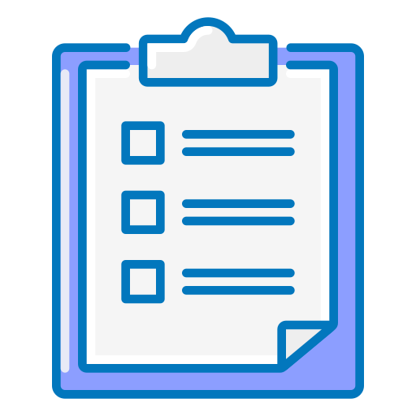
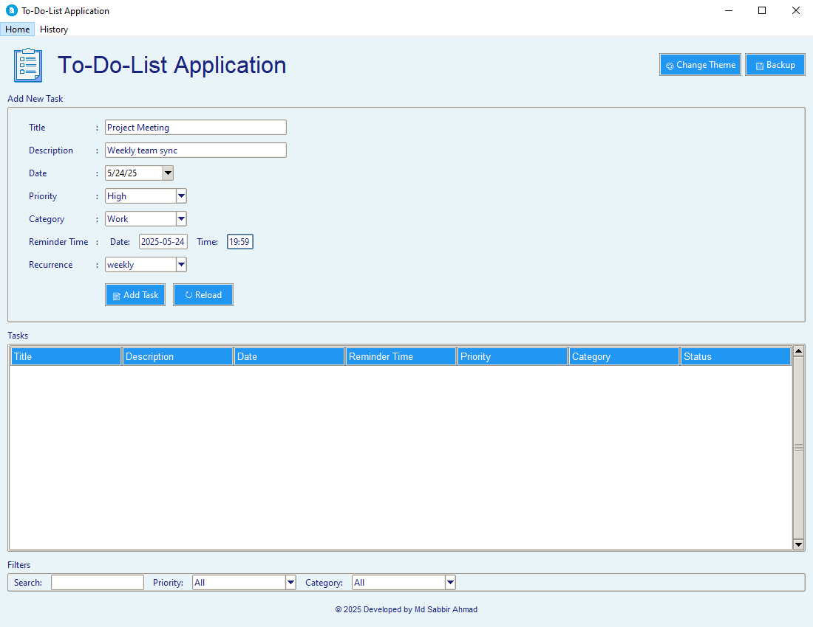
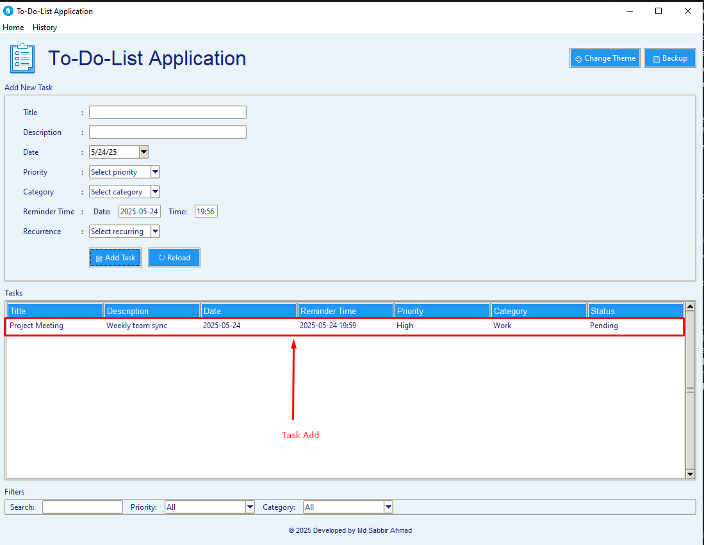
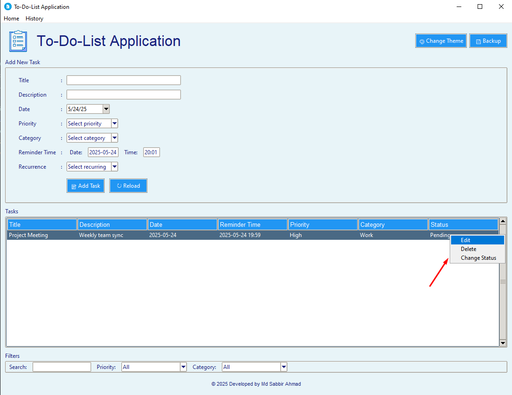
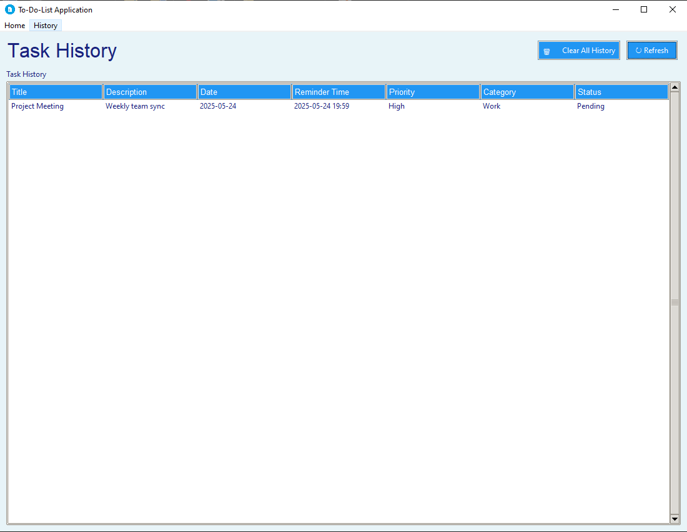
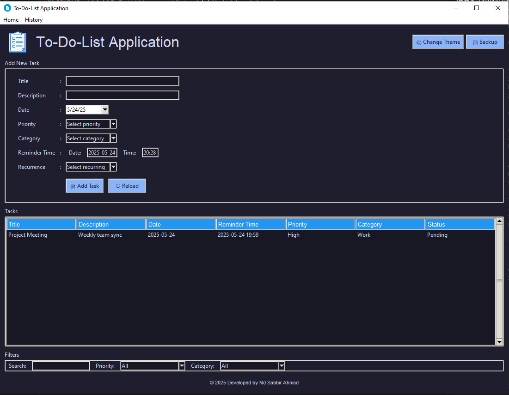

# To Do List Management System

<div align="center">
  
[](https://www.python.org/downloads/)
[](LICENSE)
[]()
[]()


  
  
  *A comprehensive task management solution for professionals*
</div>

## 📑 Table of Contents
- [Overview](#-overview)
- [Features](#-features)
- [Screenshots](#-screenshots)
- [Requirements](#-requirements)
- [Installation](#-installation)
- [Usage Guide](#-usageguide)
- [Theme Customization](#-themecustomization)
- [Project Structure](#-projectstructure)
- [Technical Details](#-technicaldetails)
- [Contributing](#-contributing)
- [License](#-license)
- [Authors](#-authors)
- [Acknowledgments](#-acknowledgments)
- [Star And Fork](#-starandfork)
- [Support](#-supportme)

## 🌟 Overview

A sophisticated task management application built with Python Tkinter, designed for professionals who need a robust solution for managing their daily tasks and projects. The application combines modern UI design with powerful features to provide a seamless task management experience.

### Key Highlights
- **Modern UI/UX**: Professional-grade interface with dark/light theme support
- **Data Security**: Automatic backups and data persistence
- **Smart Features**: Intelligent task organization and reminder system
- **Cross-Platform**: Works on Windows, macOS, and Linux

## 🌟 Features

### Task Management
- **Create & Edit Tasks**
  - Title and detailed description
  - Due date with calendar picker
  - Priority levels (High, Medium, Low)
  - Custom categories (Work, Personal, Shopping, Health, Education)
  - Status tracking (Complete/Incomplete)

- **Advanced Task Features**
  - Recurring task support
  - Task history tracking
  - Bulk task operations
  - Task dependencies
  - Progress tracking

### Modern Interface
- **Professional Design**
  - Clean, intuitive layout
  - Custom-styled Treeview
  - Responsive design elements
  - Professional color scheme
  - Custom icons and indicators

- **User Experience**
  - Right-click context menus
  - Drag-and-drop functionality
  - Quick action shortcuts
  - Intuitive navigation
  - Smooth animations

### Data Management
- **Storage & Security**
  - Excel-based data storage
  - Automatic data persistence
  - Secure backup system
  - Data recovery options
  - Export capabilities

- **Organization**
  - Smart task categorization
  - Advanced filtering system
  - Powerful search functionality
  - Custom sorting options
  - Task grouping

### Advanced Features
- **Productivity Tools**
  - Smart reminders
  - System notifications
  - PDF report generation
  - Task analytics
  - Progress tracking

- **Integration**
  - System calendar integration
  - Email notifications
  - Cloud backup support
  - Export/Import functionality
  - API support


## 🖼️ Screenshots

### Main Application Window (Light Theme)
This screenshot shows the main interface where you can add new tasks, view existing tasks in the list, and use filters.



### Task Added to List (Light Theme)
After adding a task, it appears in the task list below the input section, showing all the details including the Reminder Time.



### Task Context Menu (Light Theme)
Right-click on any task in the list to access quick actions like Edit, Delete, and Change Status.



### Task History Page (Light Theme)
Access the history page to view all your past tasks, including completed and deleted ones. The history list also includes the Reminder Time.



### Main Application Window (Dark Theme)
This screenshot displays the main application window with the dark theme enabled, showing a task added to the list.



## 📋 Requirements

### System Requirements
- Python 3.7 or higher
- 4GB RAM minimum
- 100MB free disk space
- Windows 10/11, macOS 10.14+, or Linux

### Python Dependencies
```bash
# Core Dependencies
pandas==2.1.4           # Data manipulation and analysis
openpyxl==3.1.2         # Excel file handling
tkcalendar==1.6.1       # Calendar widget
ttkthemes==3.2.2        # UI theming
reportlab==4.0.8        # PDF generation
plyer==2.1.0            # System notifications
schedule==1.2.0         # Task scheduling
pillow==10.2.0          # Image processing
python-dateutil==2.8.2  # Date handling
```

## 🚀 Installation

### Quick Start
1. Clone the repository:
   ```bash
   git clone https://github.com/sabbirahmad12/to-do-list-application.git
   cd to-do-list-application
   ```

2. Create a virtual environment (recommended):
   ```bash
   python -m venv venv
   source venv/bin/activate  # On Windows: venv\Scripts\activate
   ```

3. Install dependencies:
   ```bash
   pip install -r requirements.txt
   ```

4. Run the application:
   ```bash
   python main.py
   ```

### Development Setup
1. Install development dependencies:
   ```bash
   pip install -r requirements-dev.txt
   ```

2. Set up pre-commit hooks:
   ```bash
   pre-commit install
   ```

## 💻 Usage Guide

### Basic Operations
1. **Adding Tasks**
   ```python
   # Example task creation
   task = {
       "Title": "Project Meeting",
       "Description": "Weekly team sync",
       "Due Date": "2024-03-25",
       "Priority": "High",
       "Category": "Work"
   }
   ```

2. **Managing Tasks**
   - Use right-click menu for quick actions
   - Drag and drop for reordering
   - Double-click to edit
   - Use keyboard shortcuts for efficiency

### Advanced Usage
1. **Task Organization**
   - Create custom categories
   - Set up recurring tasks
   - Use filters and search
   - Generate reports

2. **Data Management**
   - Regular backups
   - Data export
   - History tracking
   - Analytics

## 🎨 Theme Customization

### Available Themes
- **Light Theme**
  - Professional white background
  - High contrast text
  - Subtle shadows
  - Clean lines

- **Dark Theme**
  - Eye-friendly dark mode
  - Reduced eye strain
  - Modern aesthetics
  - Consistent contrast

### Custom Styling
- Priority colors
- Category indicators
- Status badges
- Custom fonts
- Icon sets

## 📁 Project Structure
  ```bash
    project/
    ├── data/                 # Data storage
    │   ├── tasks.xlsx        # Main task database
    │   └── history.xlsx      # Task history
    ├── backups/              # Backup storage
    │   └── task_backups/     # Automatic backups
    ├── img/                  # Image assets
    │   └── img.png           # Application logo
    ├── main.py               # Main application
    ├── database.py           # Database operations
    ├── notifications.py      # Notification system
    ├── history.py            # History management
    └── requirements.txt      # Dependencies
  ```

## 🔧 Technical Details

### Architecture
- **Frontend**: Tkinter-based GUI
- **Backend**: Python with pandas
- **Storage**: Excel-based database
- **Notifications**: System-level integration

### Key Components
1. **Main Application (main.py)**
   - UI rendering
   - Event handling
   - Theme management
   - User interactions

2. **Database Manager (database.py)**
   - Data persistence
   - CRUD operations
   - Backup management
   - Data validation

3. **Notification System (notifications.py)**
   - Reminder scheduling
   - System notifications
   - Email alerts
   - Sound notifications

4. **History Manager (history.py)**
   - Task history
   - Activity logging
   - Analytics
   - Report generation

## 🤝 Contributing

We welcome contributions! Please follow these steps:

1. Fork the repository
2. Create a feature branch
3. Commit your changes
4. Push to the branch
5. Create a Pull Request

### Development Guidelines
- Follow PEP 8 style guide
- Write unit tests
- Update documentation
- Use meaningful commit messages

## 📝 License

This project is licensed under the MIT License - see the [LICENSE](LICENSE) file for details.

## 👥 Authors

- **Md Sabbir Ahmad** - *Initial work* - [GitHub Profile](https://github.com/sabbirahmad12)

## 🙏 Acknowledgments

- Thanks to all contributors
- Inspired by modern task management tools
- Built with Python and Tkinter
- Uses various open-source libraries

## 🌟 Star and Fork 🚀

### Thanks For Star🙏👨‍💻
[](https://github.com/sabbirahmad12/to-do-list-application/)

### Thanks For Fork 🙏👨‍💻

[](https://github.com/sabbirahmad12/to-do-list-application/network/members)

## Support Me ❤️

<div align="center">
  
  Thanks for visiting!
  
  [](https://www.buymeacoffee.com/mdsabbirahmad42)
  
</div>


---

<div align="center">
  Made with ❤️ by Md Sabbir Ahmad
</div> 
